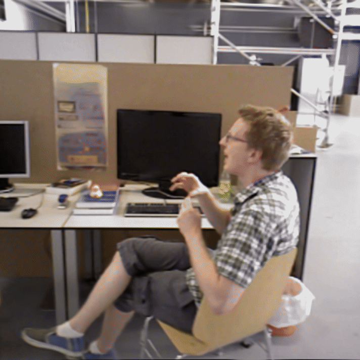
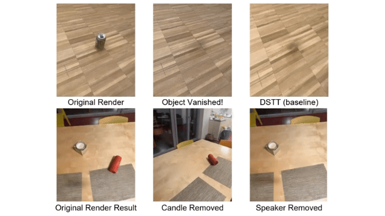
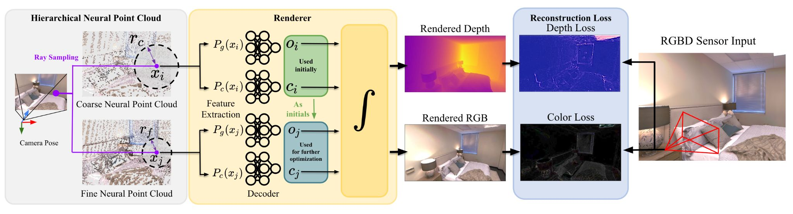
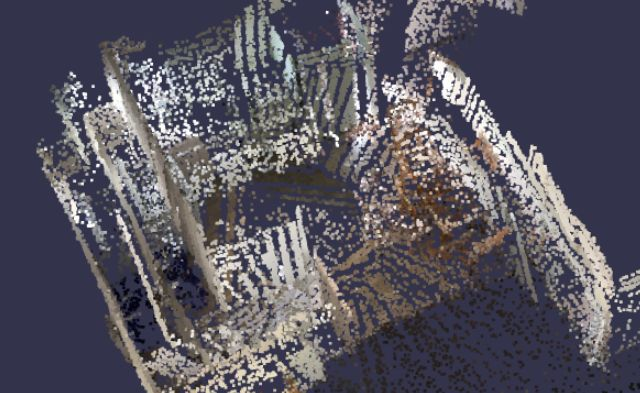
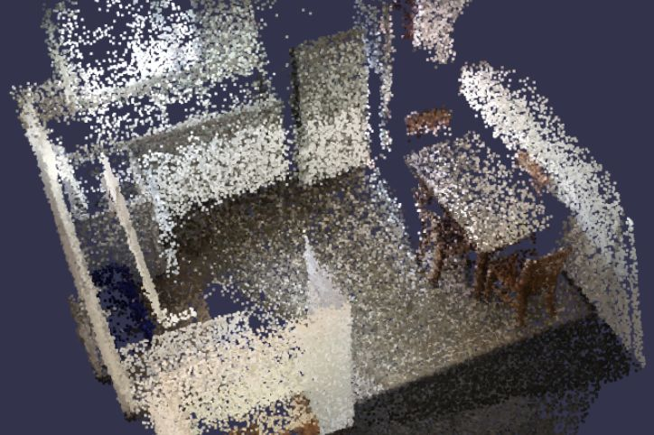
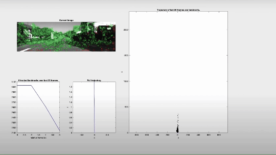
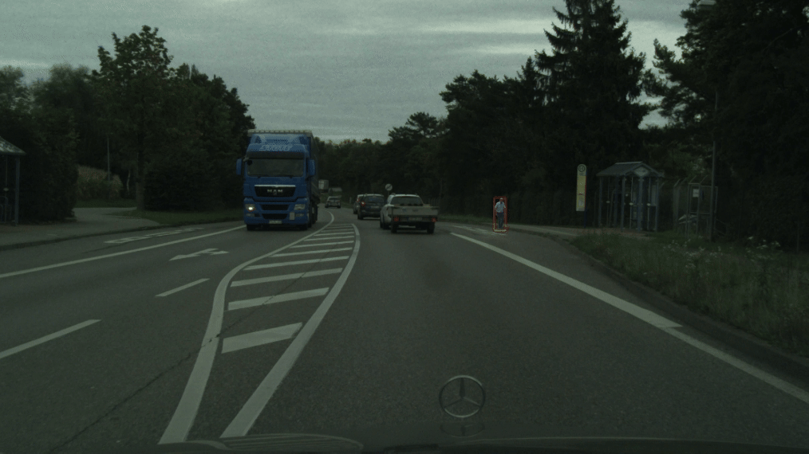

Hi there! My name is Shi Chen (Simplified Chinese: 陈实, Japanese: 陳 実). I am currently pursuing a master's degree in Electrical Engineering and Information Technology at [ETH Zurich](https://ethz.ch/en.html). Previously, I completed my Bachelor's degree at [Kyoto University](https://www.kyoto-u.ac.jp/en), where I worked on my thesis under the supervision of [Prof. Ko Nishino](https://vision.ist.i.kyoto-u.ac.jp/) and [Prof. Shohei Nobuhara](https://shohei.nobuhara.org/index.en.html).

My research interests lie in 3D vision, particularly in 3D/4D reconstruction and visual SLAM. My current goal is to enable the creation of immersive, interactive, and physically plausible digital copies of the dynamic world. Beyond that, I am fascinated by the idea of endowing machines with [spatial intelligence](https://www.worldlabs.ai/about).

# Education

* 2022 - Present, M.Sc. Electrical Engineering and Information Technology, ETH Zurich, Switzerland.
* 2018 - 2022, B.E. Electrical and Electronic Engineering, Kyoto University, Japan.

# Selected Projects

## MonoDy-GS: Online Monocular Dynamic Gaussian Splatting
Semester project in Spring 2024\
Advisors: [Prof. Martin R. Oswald](https://cvg.ethz.ch/team/Dr-Martin-R-Oswald), [Dr. Sandro Lombardi](https://www.sandrolombardi.com/en/), [Prof. Marc Pollefeys](https://people.inf.ethz.ch/marc.pollefeys/)\
[[Slides](/files/MonoDy-GS_presentation_static.pdf)][[Report](/files/MonoDy_GS_report_ShiChen_1016.pdf)]

 

* An online system using 3D Gaussians to model dynamic scenes from monocular RGB-D inputs.
* Incorporated various real-world priors to compensate for the lack of multiview information

## EvenNICER-SLAM: Event-based Neural Implicit Encoding SLAM
Semester project in Fall 2022\
Advisors: [Dr. Danda Pani Paudel](https://insait.ai/dr-danda-paudel/), [Prof. Luc Van Gool](https://vision.ee.ethz.ch/people-details.OTAyMzM=.TGlzdC8zMjg3LC0xOTcxNDY1MTc4.html)\
[[Slides](/files/EvenNICER-SLAM_Presentation_ShiChen.pdf)][[Report](/files/Semester_Project_Report_ShiChen.pdf)][[arXiv](https://arxiv.org/abs/2410.03812)][[Code](https://github.com/cs-vision/EvenNICER-SLAM)]

 

* Integrated event input into the [NICE-SLAM](https://pengsongyou.github.io/nice-slam) pipeline to for more robust camera tracking in challenging scenarios involving fast camera motion or low frame rates.
* Quantitative evaluations demonstrate that EvenNICER-SLAM significantly outperforms NICE-SLAM in scenarios with reduced RGB-D input frequency.

## NeRaser: NeRF-based 3D Object Eraser
Course Project for [Mixed Reality](https://cvg.ethz.ch/lectures/Mixed-Reality/)\
<strong>Shi Chen</strong>, Liuxin Qing, Shao Zhou, Xichong Ling\
Advisors: [Dr. Sandro Lombardi](https://www.sandrolombardi.com/en/), [Prof. Marc Pollefeys](https://people.inf.ethz.ch/marc.pollefeys/)\
[[Demo](https://www.youtube.com/watch?v=cF8qTAb9TMs)][[Poster](/files/poster.pdf)][[Report](/files/Mixed_Reality_Report.pdf)][[Code](https://github.com/MixedRealityETHZ/Let-Objects-vanish-)]

* Built upon [nerfstudio](https://docs.nerf.studio/) an interactive framework for object removal from 3D NeRF-represented scenes.
* Applied a 3D-aware inpainting strategy to ensure multiview visual consistency.

## Hierarchical Dense Neural Point Cloud-based SLAM
Course project for [3D Vision](https://cvg.ethz.ch/lectures/3D-vision/2023)\
<strong>Shi Chen</strong>, Guo Han, Liuxin Qing, Longteng Duan\
Advisors: [Dr. Erik Sandström](https://www.linkedin.com/in/eriksandstr%C3%B6m/?originalSubdomain=ch), [Prof. Martin R. Oswald](https://cvg.ethz.ch/team/Dr-Martin-R-Oswald)\
[[Poster](/files/poster_3DV.pdf)][[Report](/files/report_3DV.pdf)][[Code](https://github.com/guo-han/Hierarchical-Point-SLAM)]

 

  

A comparison of the resulting neural point cloud reconstructed from ScanNet scene 0181.   (Left: Point-SLAM. Right: Ours)

* Built upon [Point-SLAM](https://github.com/eriksandstroem/Point-SLAM) a coarse-to-fine-optimization strategy leveraging multiple sets of point cloud with varying resolutions.
* Improved tracking robustness against real-world imaging effects such as motion blur and specularities.

## Monocular Visual Odometry
Course Project for [Vision Algorithms for Mobile Robotics](https://rpg.ifi.uzh.ch/teaching.html)\
<strong>Shi Chen</strong>, Bowei Liu, Hanyu Wu, Kehan Wen\
Supervisor: [Prof. Davide Scaramuzza](https://rpg.ifi.uzh.ch/people_scaramuzza.html)\
[[Demo(KITTI)](https://youtu.be/Vox3zYr6nsY)][[Demo(Malaga)](https://youtu.be/7Sj3SLY8QuU)][[Demo(Parking)](https://youtu.be/MsBfpxU7oRM)][[Report](/files/VAMR_mini_project_Report_Chen_Liu_Wen_Wu.pdf)]

 

* Implemented in MATLAB a monocular feature-matching-based visual odometry pipeline.

## Road Scene Pedestrian Relocation for Data Augmentation
Bachelor's thesis\
Supervisors: [Prof. Ko Nishino](https://vision.ist.i.kyoto-u.ac.jp/), [Prof. Shohei Nobuhara](https://shohei.nobuhara.org/index.en.html)\
[[Slides](/files/presentation_schen.pdf)][[Thesis](/files/2021_sotsuron_schen-compressed.pdf)]

 

* Devised data augmentation method that automatically cuts out large-scale pedestrians in foreground of road-scene videos and relocates them at farther positions with correct scale and occlusion.
* Proposed method improves Mask R-CNN in both detection and instance segmentation of far-away pedestrians.

# Miscellaneous

I was born into a Chinese family in Yokohama, Japan, and spent my childhood there, so I am fluent in both Mandarin Chinese and Japanese. I can also speak some (洋泾浜) Shanghainese and (エセ) Kansai dialects.

I’m a big fan of Karaoke and J-POP music. My favorite artists include BUMP OF CHICKEN, Hikaru Utada, Tokyo Incidents, Kenshi Yonezu, King Gnu, Mr.Children, Sakanaction, Gen Hoshino, and TOMOO. It can take forever if you ask me for J-POP recommendations.

I enjoy watching soccer, basketball and tennis games. Not going to reveal here which teams I support, just in case you happen to root for their rival teams.

<!-- 
 -->

<!-- 
 -->
