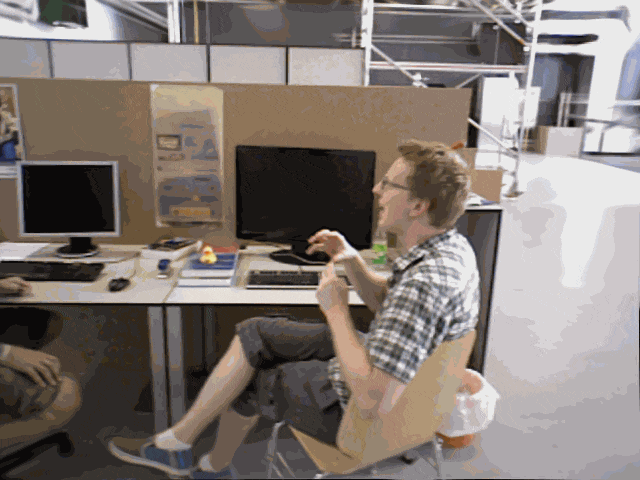

Hi there! My name is Shi Chen (Simplified Chinese: 陈实, Japanese: 陳 実). I am currently pursuing a master's degree in Electrical Engineering and Information Technology at [ETH Zurich](https://ethz.ch/en.html). Previously, I completed my Bachelor's degree at [Kyoto University](https://www.kyoto-u.ac.jp/en), where I worked on my thesis under the supervision of [Prof. Ko Nishino](https://vision.ist.i.kyoto-u.ac.jp/) and [Prof. Shohei Nobuhara](https://shohei.nobuhara.org/index.en.html).

My research interests lie in 3D vision, particularly in 3D/4D reconstruction and SLAM. My current goal is to enable the creation of immersive, interactive, and physically plausible digital copies of the dynamic world. Beyond that, I am fascinated by the idea of endowing machines with [spatial intelligence](https://www.worldlabs.ai/about).

# Education

* 2022 - Present, M.Sc. Electrical Engineering and Information Technology, ETH Zurich, Switzerland.
* 2018 - 2022, B.E. Electrical and Electronic Engineering, Kyoto University, Japan.

# Selected Projects

## MonoDy-GS: Online Monocular Dynamic Gaussian Splatting
Semester project in spring 2024

Advisors: [Prof. Martin R. Oswald](https://cvg.ethz.ch/team/Dr-Martin-R-Oswald), [Dr. Sandro Lombardi](https://www.sandrolombardi.com/en/), [Prof. Marc Pollefeys](https://people.inf.ethz.ch/marc.pollefeys/)

[[Slides](https://docs.google.com/presentation/d/1ZZd8p6BkW4RnKngYMYzRbbVutVYvALn3/edit?usp=sharing&ouid=104949219375841160899&rtpof=true&sd=true)][[Report](https://drive.google.com/file/d/1gT9UEBXINQKWijlRGbQHlopQxDnClZ-u/view?usp=sharing)]

 

* An online system using 3D Gaussians to model dynamic scenes from monocular RGB-D inputs.
* Incorporated various real-world priors to compensate for the lack of multiview information

## NeRaser: NeRF-based 3D Object Eraser
Course Project for [Mixed Reality](https://cvg.ethz.ch/lectures/Mixed-Reality/)

<strong>Shi Chen</strong>, Liuxin Qing, Shao Zhou, Xichong Ling

Advisor: [Dr. Sandro Lombardi](https://www.sandrolombardi.com/en/)

[[Demo](https://www.youtube.com/watch?v=cF8qTAb9TMs)][[Poster](https://drive.google.com/file/d/1s0A6tukIOOqnCD_Sq6JF1spPGzSTJNLw/view?usp=sharing)][[Report](https://drive.google.com/file/d/11ozGs9gKk1vGQTCfQqfgEIlClzP-ZeV1/view?usp=sharing)][[Code](https://github.com/MixedRealityETHZ/Let-Objects-vanish-)]

* Built upon [nerfstudio](https://docs.nerf.studio/) an interactive framework for object removal from 3D NeRF-represented scenes.
* Applied a 3D-aware inpainting strategy to ensure multiview visual consistency.

## EvenNICER-SLAM: Event-based Neural Implicit Encoding SLAM
Semester project in fall 2022

Advisors: [Dr. Danda Pani Paudel](https://insait.ai/dr-danda-paudel/), [Prof. Luc Van Gool](https://vision.ee.ethz.ch/people-details.OTAyMzM=.TGlzdC8zMjg3LC0xOTcxNDY1MTc4.html)

[[Slides](https://docs.google.com/presentation/d/1IT3soveZASQ7xZXn68_chInXzuQnbhkI/edit?usp=sharing&ouid=104949219375841160899&rtpof=true&sd=true)][[Report](https://drive.google.com/file/d/1N0rIO5shL_q5LIE0GQmCidqI0XVbkIFN/view?usp=sharing)][[Code](https://github.com/cs-vision/EvenNICER-SLAM)]

 

* Integrated event input into the [NICE-SLAM](https://pengsongyou.github.io/nice-slam) pipeline to for more robust camera tracking in challenging scenarios involving fast camera motion or low frame rates.
* Quantitative evaluations demonstrate that EvenNICER-SLAM significantly outperforms NICE-SLAM in scenarios with reduced RGB-D input frequency.

## Hierarchical Dense Neural Point Cloud-based SLAM
Course project for [3D Vision](https://cvg.ethz.ch/lectures/3D-vision/2023)

<strong>Shi Chen</strong>, Guo Han, Liuxin Qing, Longteng Duan

Advisors: [Dr. Erik Sandström](https://www.linkedin.com/in/eriksandstr%C3%B6m/?originalSubdomain=ch), [Prof. Martin R. Oswald](https://cvg.ethz.ch/team/Dr-Martin-R-Oswald)

[[Poster](https://drive.google.com/file/d/1wzSkARcx3P5Qbd0TNvlhbOsPUoHj2Vzi/view?usp=sharing)][[Report](https://drive.google.com/file/d/1FDcjKHl6FhQvz8U-Jh4meelX7jyZOCw5/view?usp=sharing)][[Code](https://github.com/guo-han/Hierarchical-Point-SLAM)]

 

  

A comparison of the resulting neural point cloud reconstructed from ScanNet scene 0181.   (Left: Point-SLAM. Right: Ours)

* Built upon [Point-SLAM](https://github.com/eriksandstroem/Point-SLAM) a coarse-to-fine-optimization strategy leveraging multiple sets of point cloud with varying resolutions.
* Improved tracking robustness against real-world imaging effects such as motion blur and specularities.

## Monocular Visual Odometry
Course Project for [Vision Algorithms for Mobile Robotics](https://rpg.ifi.uzh.ch/teaching.html)

<strong>Shi Chen</strong>, Bowei Liu, Hanyu Wu, Kehan Wen

Supervisor: [Prof. Davide Scaramuzza](https://rpg.ifi.uzh.ch/people_scaramuzza.html)

[[Demo(KITTI)](https://youtu.be/Vox3zYr6nsY)][[Demo(Malaga)](https://youtu.be/7Sj3SLY8QuU)][[Demo(Parking)](https://youtu.be/MsBfpxU7oRM)][[Report](https://drive.google.com/file/d/13bDmpGg9LLla7kAKFer-LkE74iFlOdF1/view?usp=sharing)]

 

* Implemented in MATLAB a monocular feature-matching-based visual odometry pipeline.

## Road Scene Pedestrian Relocation for Data Augmentation
Bachelor's thesis

Supervisors: [Prof. Shohei Nobuhara](https://shohei.nobuhara.org/index.en.html), [Prof. Ko Nishino](https://vision.ist.i.kyoto-u.ac.jp/)

[[Slides](https://docs.google.com/presentation/d/1bg_G56CoQo9WNpZ6m22G0dT58Pk4f-1t/edit?usp=sharing&ouid=104949219375841160899&rtpof=true&sd=true)][[Report](https://drive.google.com/file/d/18VdXkPMt8bhMKF_6RRhEXWqs8JwxN1KQ/view?usp=sharing)]

 

* Devised data augmentation method that automatically cuts out large-scale pedestrians in foreground of road-scene videos and relocates them at farther positions with correct scale and occlusion.
* Proposed method improves Mask R-CNN in both detection and instance segmentation of far-away pedestrians.
